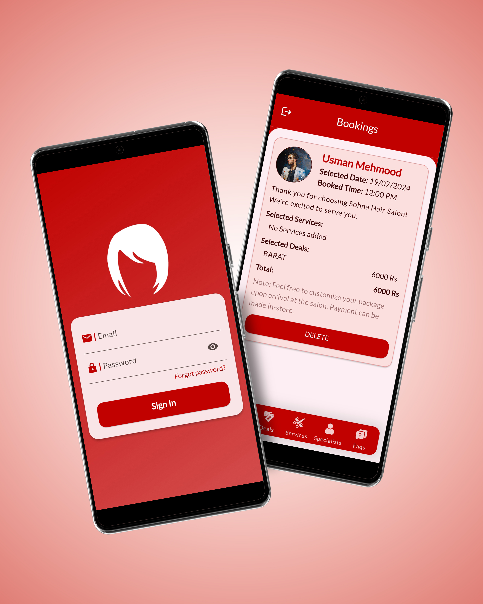
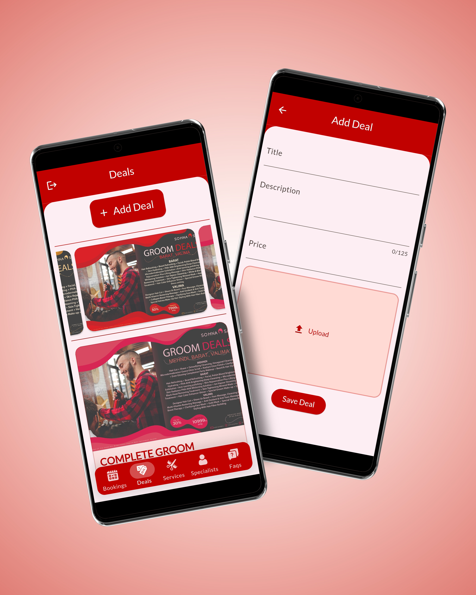
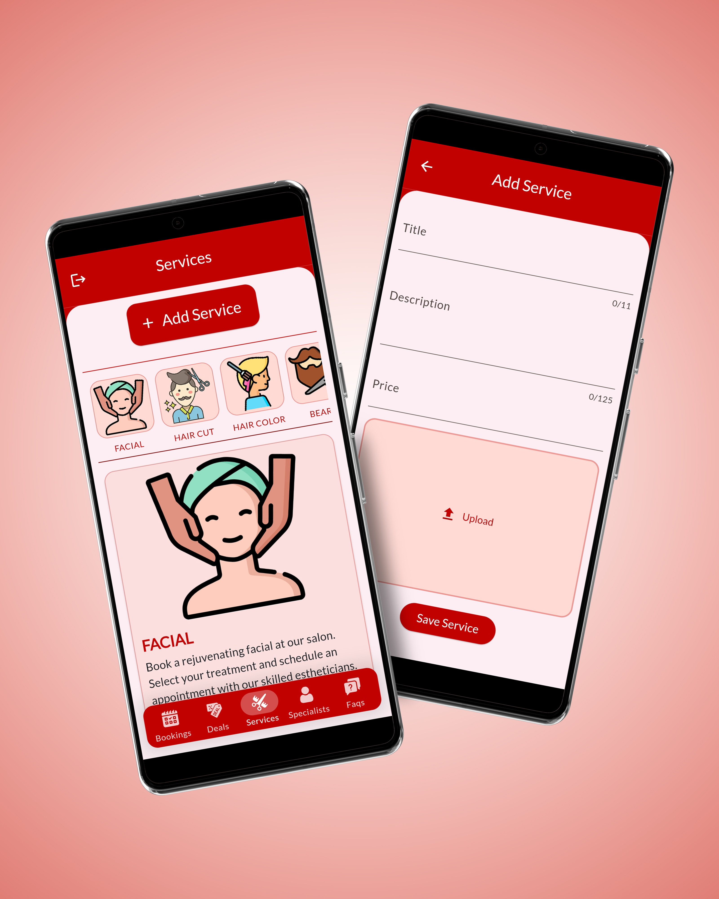
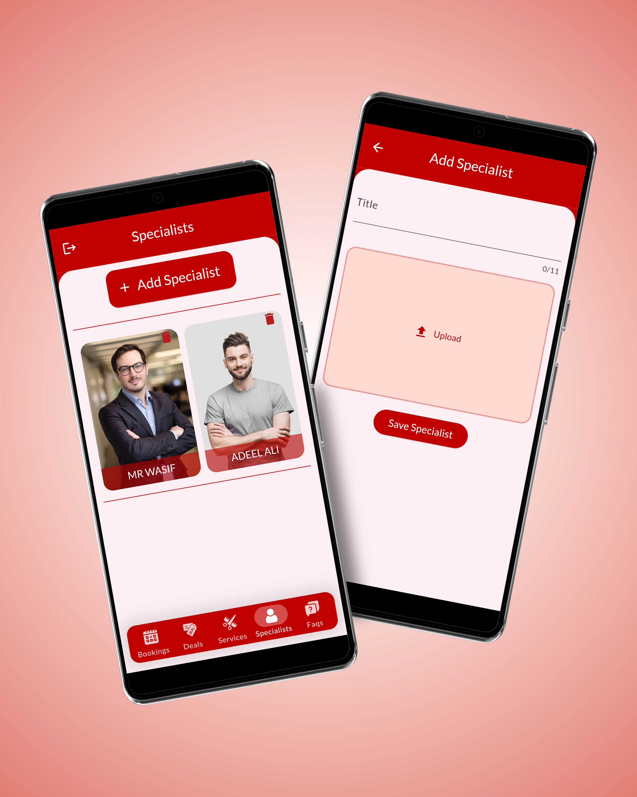
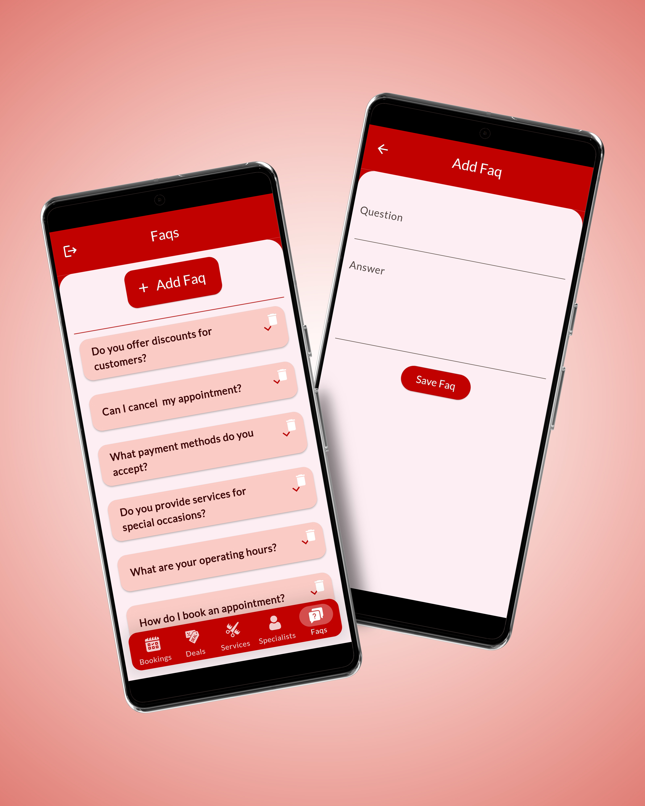

# 💼 Sohna Studio Admin – Salon Management App

## 📱 App Screens

  
  
  
  
  

---

## 📝 Description

**Sohna Studio Admin** is the dedicated admin panel for managing the **Sohna Studio** salon app.
Built with **Flutter** and powered by **Firebase**, it allows salon administrators to efficiently manage bookings, services, deals, specialists, and FAQs. All updates are reflected in real-time on the customer-facing **Sohna Studio App**.

The app provides a **clean, responsive interface** for salon owners or managers to control every aspect of their salon’s offerings and customer interactions.

---

## 🌟 Key Features

### 🛂 Authentication

* Secure login via **admin-only email/password**

### 📅 Bookings Management

* View, manage, and update all **user bookings**

### 💸 Deals Management

* Add, edit, or remove deals with **images, titles, and descriptions**
* Changes instantly reflect in the **Sohna Studio App**

### 💇 Services Management

* Manage all salon services, including images, titles, and descriptions
* Real-time updates visible in the customer app

### 👩‍🎨 Specialist Management

* Add, edit, or remove **specialist profiles** with images and details
* Updates reflected in the main app

### ❓ FAQs Management

* Manage frequently asked questions displayed in the customer app

---

## ⚙️ Backend & State Management

* **Firebase** for storing and fetching data
* **Stream Provider** & **RiverPod** for reactive state management

---

## 🚀 Tech Stack

* **Framework:** Flutter
* **Language:** Dart
* **State Management:** RiverPod / Provider
* **Platform:** Android & iOS

---

## 🔮 Future Enhancements

* Push notifications for bookings and promotions
* Loyalty program and rewards system
* Dark mode support
* Multi-language support

